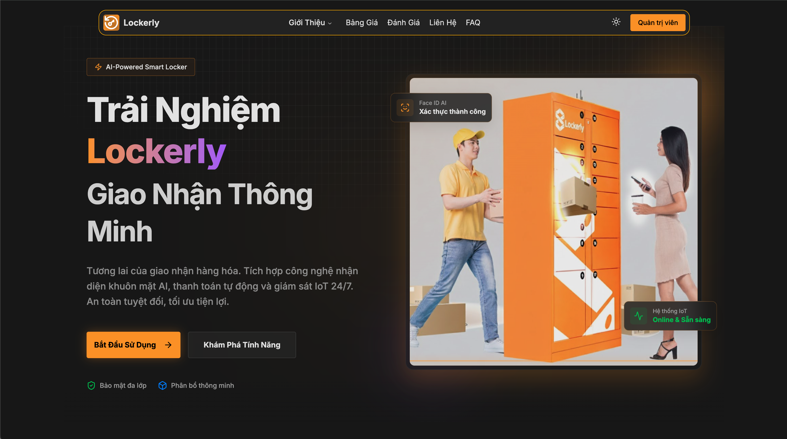
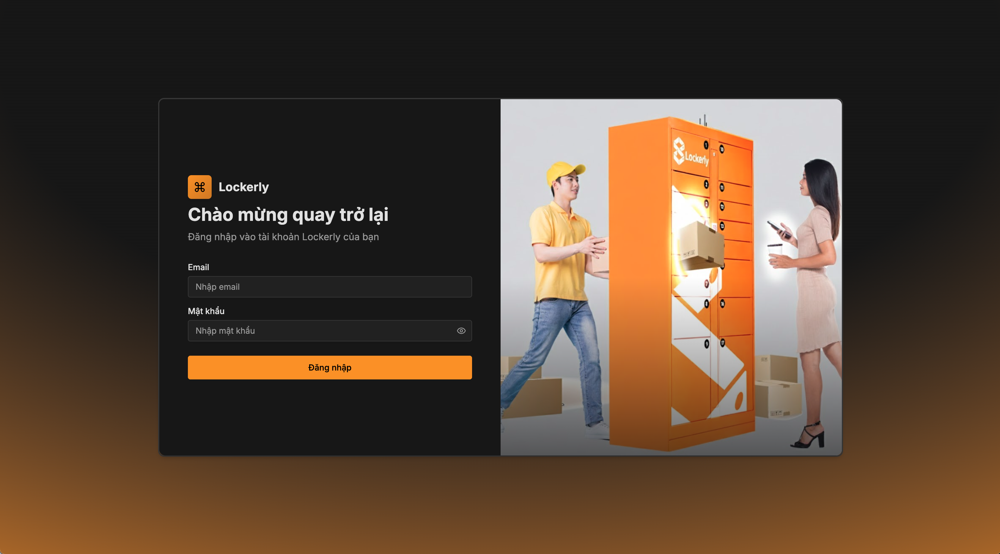
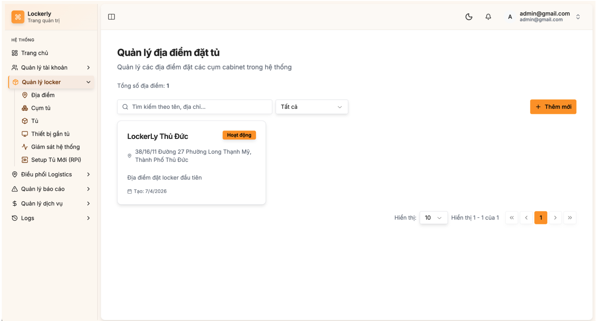
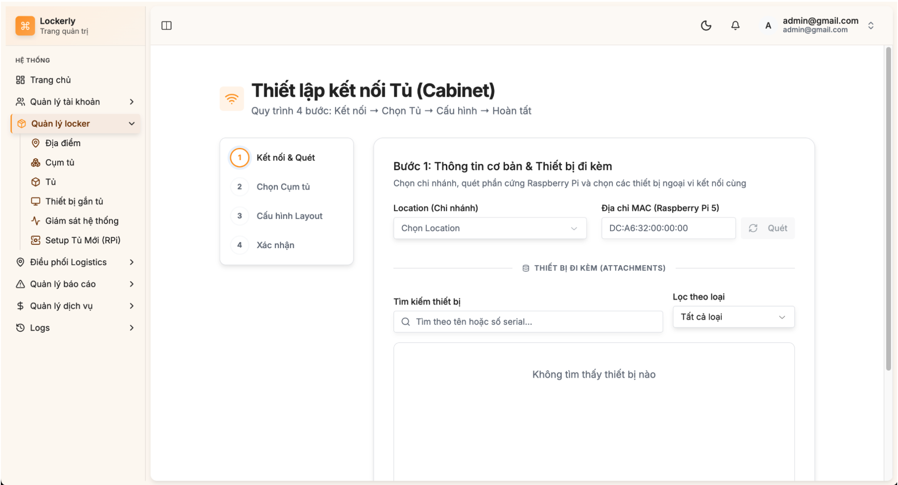
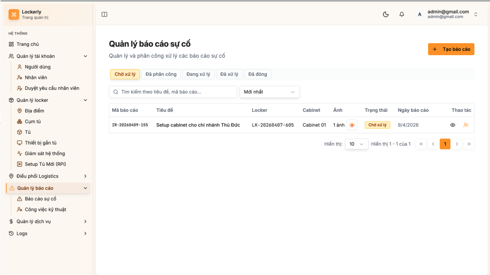
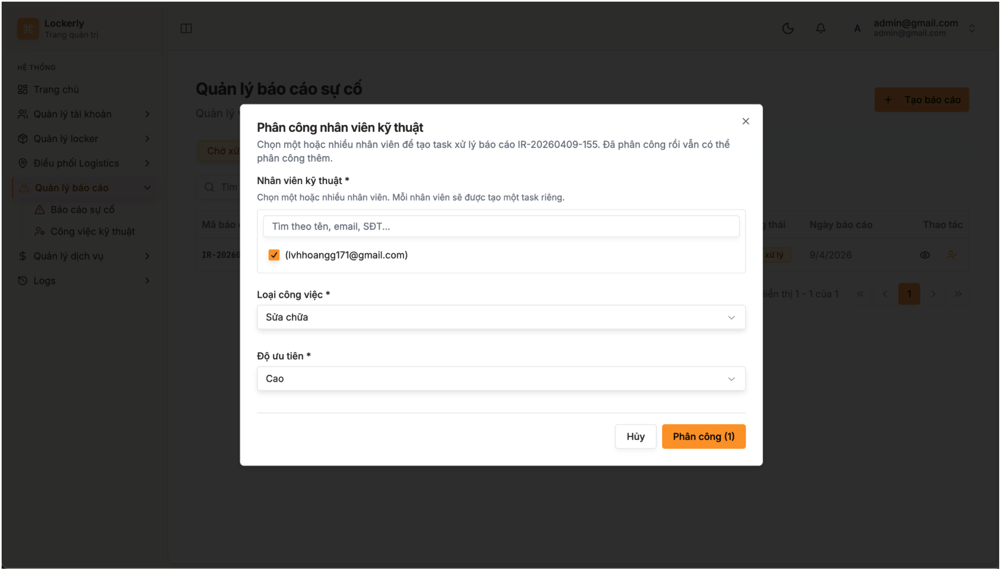
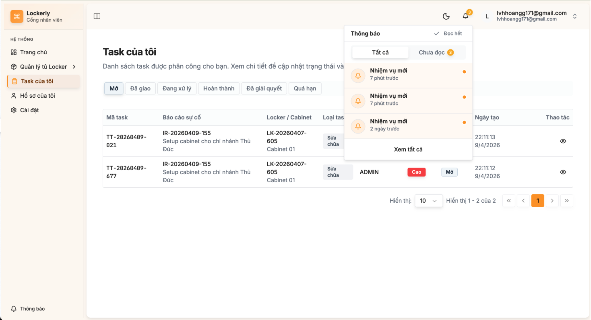
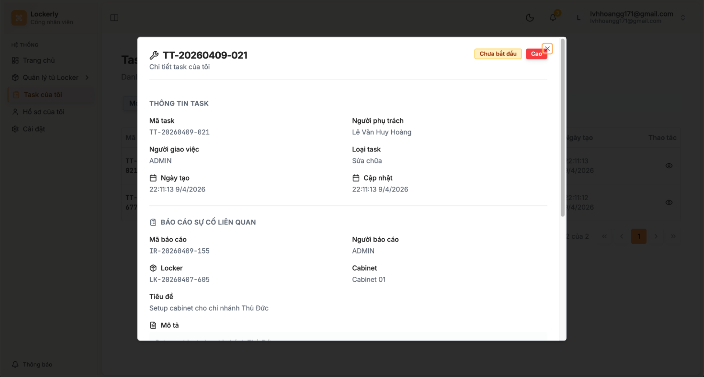
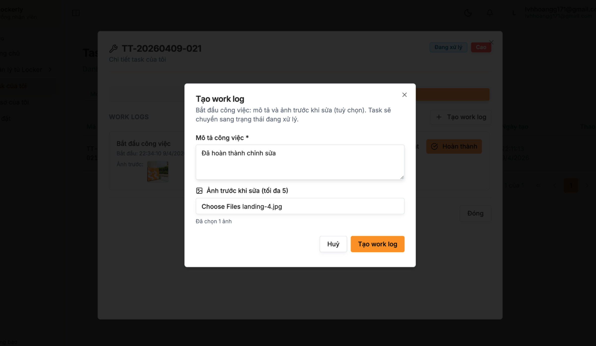
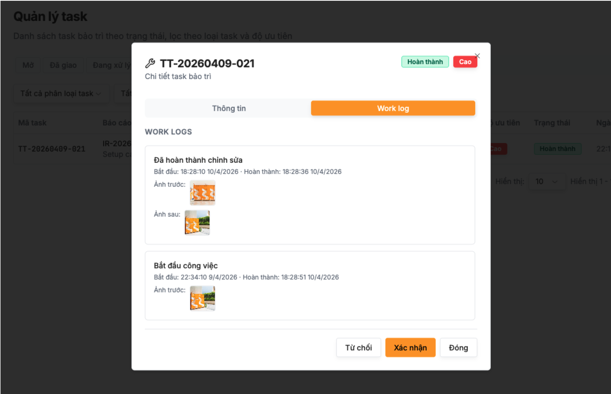

# 🔥 LockerLy - Hệ thống quản lý tủ khoá thông minh (Capstone Project Frontend)

<div align="center">

**Giải pháp quản lý và cho thuê tủ khoá tự động, an toàn và tiện lợi (Admin Dashboard)**

[](https://react.dev/)
[](https://vitejs.dev/)
[](https://tailwindcss.com/)
[](https://www.typescriptlang.org/)

</div>

## 📋 Mục lục

- [Giới thiệu](#-giới-thiệu)
- [Tính năng chính](#-tính-năng-chính)
- [Công nghệ sử dụng](#-công-nghệ-sử-dụng)
- [Cấu trúc thư mục](#-cấu-trúc-thư-mục)

## 🎯 Giới thiệu

**LockerLy** là hệ thống quản lý tủ khoá thông minh, cung cấp giao diện quản trị (Admin Dashboard) hiện đại dành cho người quản lý hệ thống locker. Giao diện được thiết kế tối ưu trải nghiệm người dùng, giúp dễ dàng theo dõi trạng thái tủ khoá, quản lý người dùng, giao dịch và phân tích dữ liệu theo thời gian thực.

*(Lưu ý: Đây là dự án thuần Frontend của Đồ án Capstone)*

## ✨ Tính năng chính

### 1. Quản lý Tủ khoá (Locker Management)
- ✅ **Giám sát trạng thái**: Theo dõi trạng thái từng ngăn tủ (trống, đang sử dụng, bảo trì) theo thời gian thực (Real-time).
- ✅ **Bản đồ vị trí**: Tích hợp bản đồ hiển thị trực quan vị trí các trạm tủ khoá trên hệ thống.

### 2. Quản lý Người dùng & Giao dịch
- ✅ **Hồ sơ & Phân quyền**: Quản lý thông tin khách hàng, nhân viên và lịch sử sử dụng tủ.
- ✅ **Lịch sử giao dịch**: Theo dõi và thống kê lịch sử thanh toán, hóa đơn thuê tủ.

### 3. Hệ thống Quản trị (Admin Dashboard)
- ✅ **Thống kê tổng quan**: Biểu đồ trực quan báo cáo doanh thu, tần suất sử dụng và trạng thái hoạt động của hệ thống.
- ✅ **Quản lý thiết bị**: Cấu hình và điều khiển đóng/mở tủ khoá từ xa.

## 🛠 Công nghệ sử dụng

### ✨ Frontend (Web Client) 
- **Framework:** React 19, Vite
- **Ngôn ngữ:** TypeScript
- **State Management:** Zustand, Redux Toolkit, React Query
- **Routing:** React Router v7
- **Styling:** Tailwind CSS v4, Shadcn UI (Radix UI)
- **Bản đồ & Biểu đồ:** Leaflet, Recharts
- **Khác:** Firebase, Socket.io-client, Axios, React Hook Form, Zod.

## 📁 Cấu trúc thư mục

Dự án được thiết kế theo kiến trúc **Feature-based** (chia theo chức năng), giúp cô lập logic và dễ dàng mở rộng:

```text
aisl-web/
├── public/                 # Tài nguyên tĩnh
├── src/                    # Mã nguồn chính (Frontend Code)
│   ├── app/                # Root app components (vd: dashboard)
│   ├── assets/             # Hình ảnh, icons, styles
│   ├── features/           # Các module chức năng độc lập
│   │   ├── admin/          # Module quản trị viên (Admin)
│   │   │   ├── api/        # Các hàm gọi API của admin
│   │   │   ├── components/ # Các UI Components riêng của admin
│   │   │   ├── configs/    # Cấu hình (menus, constants...)
│   │   │   ├── features/   # Các tính năng con của admin
│   │   │   ├── pages/      # Các trang giao diện chính
│   │   │   └── routes/     # Cấu hình định tuyến (Routing)
│   │   └── auth/           # Module xác thực (Authentication)
│   │       ├── api/        # API đăng nhập, đăng ký
│   │       ├── pages/      # Các trang giao diện auth
│   │       ├── services/   # Logic xử lý dịch vụ auth
│   │       ├── store/      # Quản lý state (vd: Zustand store)
│   │       ├── types/      # Định nghĩa kiểu dữ liệu (TypeScript)
│   │       └── index.ts    # Public API export cho module này
│   ├── App.tsx             # Root Component
│   ├── main.tsx            # Entry point
│   └── index.css           # Global Styles
├── package.json            # Quản lý dependencies
└── vite.config.ts          # Cấu hình Vite
```

## 🖼 Hình ảnh demo của project

Dưới đây là một số hình ảnh demo:





















---

<div align="center">

**Nếu bạn quan tâm đến dự án LockerLy, hãy cho một ⭐ trên GitHub nhé!**

</div>