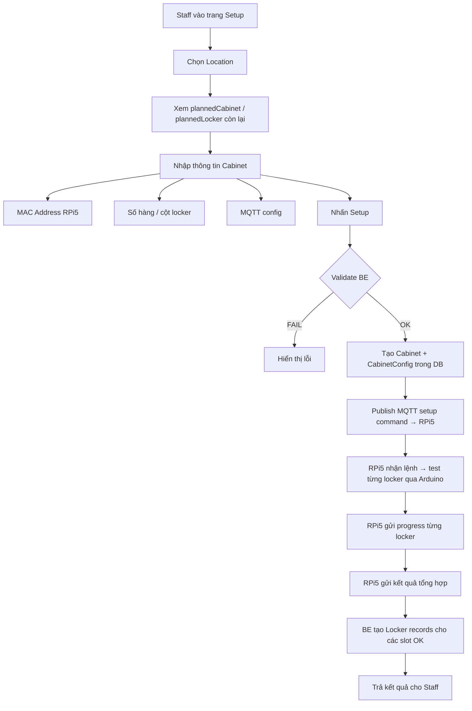

# Cabinet & Locker Setup Flow – Raspberry Pi 5

Tài liệu mô tả luồng **setup cabinet và locker** cho Raspberry Pi 5. Staff (Admin/Technician) có thể setup cabinet dựa trên **Location**, **plannedCabinet**, **plannedLocker** để điều chỉnh số lượng locker bên trong 1 cabinet và gắn RPi5 làm định danh cho cabinet đó.

> [!NOTE]
> Tham chiếu: [mqtt-locker-protocol.md](file:///e:/WorkSpace/project/aisl-project/docs/api-docs/mqtt-locker-protocol.md)

---

## 1. Tổng quan kiến trúc

```
┌──────────────┐        ┌──────────┐       ┌──────────────┐       ┌─────────┐
│  Staff       │  HTTP  │ Gateway  │ gRPC  │ Locker       │ MQTT  │  RPi 5  │
│  (Frontend)  │───────►│ (NestJS) │──────►│ Service      │──────►│(Python) │
│              │◄───────│          │◄──────│              │◄──────│         │
└──────────────┘        └──────────┘       └──────────────┘       └────┬────┘
                                                                       │ Serial
                                                                  ┌────▼────┐
                                                                  │ Arduino │
                                                                  │  Mega   │
                                                                  └─────────┘
```

### Data Model

```
Location (plannedCabinetQuantity, plannedLockerQuantity)
  └── Cabinet (macAddress, totalRows, totalColumns, connectionStatus)
        ├── CabinetConfig (mqttTopicPrefix, heartbeatInterval, isSynced, ...)
        └── Locker[] (lockerLabel, row, column, currentStatus, hwState)
```

---

## 2. Flow tổng quan Setup



---

## 3. Chi tiết từng bước

### 3.1. Bước 1 – Staff chọn Location & nhập thông tin Cabinet

**Frontend gửi form data:**

```json
{
  "locationId": "location-uuid",
  "macAddress": "DC:A6:32:XX:XX:XX",
  "totalRows": 4,
  "totalColumns": 6,
  "mqttBrokerHost": "192.168.1.100",
  "mqttBrokerPort": 1883,
  "mqttUsername": "rasp_cab001",
  "mqttPassword": "secure-password",
  "heartbeatInterval": 60,
  "openDoorTimeout": 5,
  "operatorId": "staff-uuid"
}
```

> [!IMPORTANT]
> `macAddress` là **định danh duy nhất** của RPi5. Mỗi RPi5 = 1 Cabinet. MAC address lấy từ `eth0` hoặc `wlan0` của RPi5.

### 3.2. Bước 2 – BE Validate

| Rule | Điều kiện | Lý do |
|------|-----------|-------|
| **R1** | `macAddress` chưa tồn tại trong DB | Không duplicate RPi5 |
| **R2** | Số cabinet hiện có trong location < `plannedCabinetQuantity` | Không vượt quy hoạch cabinet |
| **R3** | `totalRows × totalColumns + lockers hiện có ≤ plannedLockerQuantity` | Không vượt quy hoạch locker |
| **R4** | `locationId` hợp lệ, `isActive = true` | Location phải tồn tại |
| **R5** | `totalRows > 0 && totalColumns > 0` | Phải có slot vật lý |

### 3.3. Bước 3 – Tạo Cabinet + CabinetConfig

BE tạo record:

1. **Cabinet**: `name` (auto-gen `CAB-YYYYMMDD-XXX`), `macAddress`, `locationId`, `totalRows`, `totalColumns`, `connectionStatus = 'OFFLINE'`
2. **CabinetConfig**: `mqttTopicPrefix = "cabinet/{cabinetCode}"`, `heartbeatInterval`, `openDoorTimeout`, `isSynced = false`

### 3.4. Bước 4 – Publish MQTT Setup Command

**Topic**: `{mqttTopicPrefix}/command/setup`

```json
{
  "commandId": "uuid-v4",
  "action": "SETUP_LOCKERS",
  "cabinetId": "cabinet-uuid",
  "cabinetCode": "CAB-20260223-001",
  "totalRows": 4,
  "totalColumns": 6,
  "setupQuantity": 24,
  "lockerLayout": [
    { "row": 1, "column": 1, "slotIndex": 0 },
    { "row": 1, "column": 2, "slotIndex": 1 },
    { "row": 1, "column": 3, "slotIndex": 2 },
    { "row": 1, "column": 4, "slotIndex": 3 },
    { "row": 1, "column": 5, "slotIndex": 4 },
    { "row": 1, "column": 6, "slotIndex": 5 },
    { "row": 2, "column": 1, "slotIndex": 6 }
  ],
  "testTimeout": 10,
  "operatorId": "staff-uuid",
  "timestamp": "2026-02-23T14:00:00.000Z"
}
```

### 3.5. Bước 5 – RPi5 xử lý & test từng locker

RPi5 nhận lệnh → lần lượt gửi serial command tới Arduino test từng slot → gửi **progress** sau mỗi locker → gửi **result** tổng hợp cuối cùng.

Chi tiết protocol: xem [mqtt-locker-protocol.md – Section 9 & 10](file:///e:/WorkSpace/project/aisl-project/docs/api-docs/mqtt-locker-protocol.md)

### 3.6. Bước 6 – BE nhận kết quả & tạo Locker records

- Locker `testResult = "OK"` → tạo Locker record (`AVAILABLE`, `CLOSED`, `isActive = true`)
- Locker `testResult = "FAIL"` → **không tạo**, log LockerEvent, notify technician

---

## 4. Sequence Diagram chi tiết

```
Staff          Gateway         Locker Service      MQTT Broker       RPi 5            Arduino
  │               │                 │                  │                │                 │
  │── POST ──────►│                 │                  │                │                 │
  │ /setup-cabinet│── gRPC ────────►│                  │                │                 │
  │               │                 │── validate ─────►│                │                 │
  │               │                 │── create cabinet │                │                 │
  │               │                 │── create config  │                │                 │
  │               │                 │── publish ──────►│                │                 │
  │               │                 │  command/setup   │── deliver ────►│                 │
  │               │                 │                  │                │── TEST_SLOT 0 ─►│
  │               │                 │                  │                │◄── OK ──────────│
  │               │                 │                  │◄── progress ──│                 │
  │               │                 │◄── subscribe ───│                │                 │
  │               │                 │                  │                │── TEST_SLOT 1 ─►│
  │               │                 │                  │                │◄── OK ──────────│
  │               │                 │                  │◄── progress ──│                 │
  │               │                 │                  │    ... x N ... │                 │
  │               │                 │                  │◄── result ────│                 │
  │               │                 │◄── subscribe ───│                │                 │
  │               │                 │── create lockers │                │                 │
  │               │◄── response ───│   (only OK ones) │                │                 │
  │◄── 200 OK ───│                 │                  │                │                 │
```

---

## 5. Cấu trúc thư mục & Code mẫu

### 5.1. Folder Structure

```
apps/locker-service/src/
├── cabinets/
│   ├── cabinets.module.ts
│   ├── cabinets.controller.ts
│   ├── cabinets.service.ts            # ← Thêm setupCabinet()
│   ├── dto/
│   │   ├── create-cabinet.dto.ts
│   │   └── setup-cabinet.dto.ts       # [NEW]
│   └── mappers/
│       └── cabinet.mapper.ts
├── cabinet-configs/
│   ├── cabinet-configs.module.ts
│   ├── cabinet-configs.controller.ts
│   └── cabinet-configs.service.ts
├── lockers/
│   ├── lockers.module.ts
│   ├── lockers.controller.ts
│   └── lockers.service.ts
└── locker-service.module.ts           # ← Import MqttModule

apps/gateway/src/controllers/
├── mqtt.controller.ts
└── cabinet-setup.controller.ts        # [NEW] – REST endpoint cho staff

shared/brokers/mqtt/
├── mqtt.module.ts
├── mqtt.service.ts                    # Đã có publish/subscribe
└── mqtt.types.ts
```

### 5.2. DTO – Setup Cabinet

```typescript
// apps/locker-service/src/cabinets/dto/setup-cabinet.dto.ts
export class SetupCabinetDto {
    locationId: string
    macAddress: string        // MAC address RPi5 – định danh duy nhất
    totalRows: number
    totalColumns: number
    mqttBrokerHost: string
    mqttBrokerPort: number
    mqttUsername?: string
    mqttPassword?: string
    heartbeatInterval?: number // default 60
    openDoorTimeout?: number   // default 5
    operatorId: string
}
```

### 5.3. Proto – Thêm RPC SetupCabinet

```protobuf
// shared/grpc/proto/locker.proto – Thêm vào CabinetsService
service CabinetsService {
    // ... existing RPCs ...
    rpc SetupCabinet(SetupCabinetRequest) returns (SetupCabinetResponse);
}

message SetupCabinetRequest {
    string location_id = 1;
    string mac_address = 2;
    int32 total_rows = 3;
    int32 total_columns = 4;
    string mqtt_broker_host = 5;
    int32 mqtt_broker_port = 6;
    string mqtt_username = 7;
    string mqtt_password = 8;
    int32 heartbeat_interval = 9;
    int32 open_door_timeout = 10;
    string operator_id = 11;
}

message SetupCabinetResponse {
    string cabinet_id = 1;
    string cabinet_code = 2;
    string mqtt_topic_prefix = 3;
    string message = 4;          // "Setup command sent. Waiting for RPi response..."
    bool success = 5;
}
```

### 5.4. Gateway Controller

```typescript
// apps/gateway/src/controllers/cabinet-setup.controller.ts
import { Controller, Post, Body, UseGuards } from "@nestjs/common"
import { GrpcService } from "@shared/grpc"
import { RolesGuard } from "@shared/guards"
import { Roles } from "@shared/decorators"

@Controller("cabinets")
export class CabinetSetupController {
    constructor(private readonly grpcService: GrpcService) {}

    @Post("setup")
    @UseGuards(RolesGuard)
    @Roles("ADMIN", "TECHNICIAN")
    async setupCabinet(@Body() body: {
        locationId: string
        macAddress: string
        totalRows: number
        totalColumns: number
        mqttBrokerHost: string
        mqttBrokerPort: number
        mqttUsername?: string
        mqttPassword?: string
        heartbeatInterval?: number
        openDoorTimeout?: number
        operatorId: string
    }) {
        const cabinetsService = this.grpcService.getService("CabinetsService")
        return cabinetsService.SetupCabinet({
            locationId: body.locationId,
            macAddress: body.macAddress,
            totalRows: body.totalRows,
            totalColumns: body.totalColumns,
            mqttBrokerHost: body.mqttBrokerHost,
            mqttBrokerPort: body.mqttBrokerPort,
            mqttUsername: body.mqttUsername ?? "",
            mqttPassword: body.mqttPassword ?? "",
            heartbeatInterval: body.heartbeatInterval ?? 60,
            openDoorTimeout: body.openDoorTimeout ?? 5,
            operatorId: body.operatorId,
        })
    }
}
```

### 5.5. Cabinets Service – setupCabinet()

```typescript
// apps/locker-service/src/cabinets/cabinets.service.ts – Thêm method
import { MqttService } from "@shared/brokers/mqtt"
import { v4 as uuidv4 } from "uuid"

// Inject MqttService trong constructor
constructor(
    @InjectRepository(Cabinet) private cabinetRepo: Repository<Cabinet>,
    @InjectRepository(CabinetConfig) private configRepo: Repository<CabinetConfig>,
    @InjectRepository(Location) private locationRepo: Repository<Location>,
    @InjectRepository(Locker) private lockerRepo: Repository<Locker>,
    private readonly mqttService: MqttService,
) {}

async setupCabinet(dto: SetupCabinetDto) {
    // ─── Step 1: Validate ───
    const location = await this.locationRepo.findOne({
        where: { id: dto.locationId, isActive: true }
    })
    if (!location) {
        throw new RpcException({ code: 5, message: "Location not found or inactive" })
    }

    // R1: Check MAC address unique
    const existingCabinet = await this.cabinetRepo.findOne({
        where: { macAddress: dto.macAddress }
    })
    if (existingCabinet) {
        throw new RpcException({
            code: 6,
            message: `MAC address ${dto.macAddress} already registered to cabinet ${existingCabinet.name}`
        })
    }

    // R2: Check planned cabinet limit
    const currentCabinetCount = await this.cabinetRepo.count({
        where: { locationId: dto.locationId }
    })
    if (currentCabinetCount >= location.plannedCabinetQuantity) {
        throw new RpcException({
            code: 9,
            message: `Location reached max cabinets: ${location.plannedCabinetQuantity}`
        })
    }

    // R3: Check planned locker limit
    const currentLockerCount = await this.lockerRepo
        .createQueryBuilder("l")
        .innerJoin("l.cabinet", "c")
        .where("c.locationId = :locId", { locId: dto.locationId })
        .getCount()

    const newLockerCount = dto.totalRows * dto.totalColumns
    if (currentLockerCount + newLockerCount > location.plannedLockerQuantity) {
        throw new RpcException({
            code: 9,
            message: `Exceeds planned locker limit. Current: ${currentLockerCount}, Adding: ${newLockerCount}, Max: ${location.plannedLockerQuantity}`
        })
    }

    // ─── Step 2: Create Cabinet ───
    const cabinet = this.cabinetRepo.create({
        locationId: dto.locationId,
        locationName: location.name,
        address: location.address,
        macAddress: dto.macAddress,
        totalRows: dto.totalRows,
        totalColumns: dto.totalColumns,
        connectionStatus: "OFFLINE",
        isActive: true,
    })
    await this.cabinetRepo.save(cabinet)

    // ─── Step 3: Create CabinetConfig ───
    const mqttTopicPrefix = `cabinet/${cabinet.name.toLowerCase()}`
    const config = this.configRepo.create({
        cabinetId: cabinet.id,
        mqttTopicPrefix,
        heartbeatInterval: dto.heartbeatInterval ?? 60,
        openDoorTimeout: dto.openDoorTimeout ?? 5,
        isSynced: false,
    })
    await this.configRepo.save(config)

    // ─── Step 4: Build locker layout ───
    const lockerLayout = []
    let slotIndex = 0
    for (let row = 1; row <= dto.totalRows; row++) {
        for (let col = 1; col <= dto.totalColumns; col++) {
            lockerLayout.push({ row, column: col, slotIndex })
            slotIndex++
        }
    }

    // ─── Step 5: Subscribe to setup responses ───
    await this.subscribeSetupTopics(mqttTopicPrefix, cabinet.id)

    // ─── Step 6: Publish setup command via MQTT ───
    const commandId = uuidv4()
    const setupPayload = {
        commandId,
        action: "SETUP_LOCKERS",
        cabinetId: cabinet.id,
        cabinetCode: cabinet.name,
        totalRows: dto.totalRows,
        totalColumns: dto.totalColumns,
        setupQuantity: newLockerCount,
        lockerLayout,
        testTimeout: 10,
        operatorId: dto.operatorId,
        timestamp: new Date().toISOString(),
    }

    await this.mqttService.publishJson(
        `${mqttTopicPrefix}/command/setup`,
        setupPayload,
        { qos: 1 }
    )

    this.logger.log(`Setup command sent to ${mqttTopicPrefix} for ${newLockerCount} lockers`)

    return {
        cabinetId: cabinet.id,
        cabinetCode: cabinet.name,
        mqttTopicPrefix,
        message: `Setup command sent. Testing ${newLockerCount} lockers on RPi...`,
        success: true,
    }
}

// ─── Subscribe to RPi setup responses ───
private async subscribeSetupTopics(prefix: string, cabinetId: string) {
    // Progress updates (per-locker)
    await this.mqttService.subscribe(
        `${prefix}/setup/progress`,
        (topic, message) => {
            const data = JSON.parse(message.toString())
            this.logger.log(
                `[${cabinetId}] Progress: ${data.progress.tested}/${data.progress.total} ` +
                `(OK: ${data.progress.okCount}, FAIL: ${data.progress.failCount})`
            )
            // TODO: Emit WebSocket event to frontend for real-time progress
        },
        { qos: 1 }
    )

    // Final result
    await this.mqttService.subscribe(
        `${prefix}/setup/result`,
        async (topic, message) => {
            const result = JSON.parse(message.toString())
            await this.handleSetupResult(cabinetId, result)
        },
        { qos: 1 }
    )
}

// ─── Handle final setup result from RPi ───
private async handleSetupResult(cabinetId: string, result: any) {
    this.logger.log(
        `[${cabinetId}] Setup ${result.status}: ` +
        `OK=${result.summary.totalOk}, FAIL=${result.summary.totalFail}`
    )

    const cabinet = await this.cabinetRepo.findOne({ where: { id: cabinetId } })

    // Create lockers for OK slots only
    for (const locker of result.lockers) {
        if (locker.testResult === "OK") {
            const newLocker = this.lockerRepo.create({
                cabinetId,
                cabinetName: cabinet.name,
                row: locker.row,
                column: locker.column,
                currentStatus: LockerStatus.AVAILABLE,
                hwState: LockerHwState.CLOSED,
                isActive: true,
            })
            await this.lockerRepo.save(newLocker)
        } else {
            // Log error event for FAIL slots
            this.logger.warn(
                `[${cabinetId}] Slot ${locker.slotIndex} FAILED: ${locker.errorCode} - ${locker.errorMessage}`
            )
            // TODO: Create LockerEvent record with HARDWARE_ERROR
            // TODO: Send notification to technician
        }
    }

    // Update cabinet connection status
    await this.cabinetRepo.update(cabinetId, { connectionStatus: "ONLINE" })
}
```

### 5.6. Module – Import MqttModule

```typescript
// apps/locker-service/src/locker-service.module.ts – Thêm import
import { MqttModule } from "@shared/brokers/mqtt"

@Module({
    imports: [
        // ... existing imports ...
        MqttModule.forRoot({
            brokerUrl: process.env.MQTT_BROKER_URL || "mqtt://localhost:1883",
            options: {
                username: process.env.MQTT_USERNAME,
                password: process.env.MQTT_PASSWORD,
            }
        }),
    ],
    // ...
})
export class LockerServiceModule {}
```

### 5.7. RPi5 – Python code mẫu

```
raspberry-pi/
├── config.json              # Cấu hình cabinet (xem Section 8.1 mqtt-locker-protocol.md)
├── main.py                  # Entry point
├── mqtt_client.py           # MQTT connection & handlers
├── serial_manager.py        # Serial communication with Arduino
└── setup_handler.py         # Xử lý lệnh SETUP_LOCKERS
```

#### `config.json` (trên RPi5)

```json
{
  "cabinetId": "cabinet-uuid-from-server",
  "cabinetCode": "CAB-20260223-001",
  "mqttTopicPrefix": "cabinet/cab-20260223-001",
  "mqtt": {
    "brokerHost": "192.168.1.100",
    "brokerPort": 1883,
    "username": "rasp_cab001",
    "password": "secure-password"
  },
  "arduino": {
    "serialPort": "/dev/ttyUSB0",
    "baudRate": 115200
  }
}
```

#### `mqtt_client.py`

```python
import json
import paho.mqtt.client as mqtt
from setup_handler import SetupHandler

class MqttClient:
    def __init__(self, config: dict):
        self.config = config
        self.prefix = config["mqttTopicPrefix"]
        self.client = mqtt.Client(client_id=f"rpi-{config['cabinetCode']}")
        self.setup_handler = SetupHandler(config, self)

        self.client.username_pw_set(
            config["mqtt"]["username"],
            config["mqtt"]["password"]
        )
        self.client.on_connect = self.on_connect
        self.client.on_message = self.on_message

    def connect(self):
        self.client.connect(
            self.config["mqtt"]["brokerHost"],
            self.config["mqtt"]["brokerPort"],
            keepalive=60
        )
        self.client.loop_forever()

    def on_connect(self, client, userdata, flags, rc):
        print(f"Connected to MQTT broker (rc={rc})")
        # Subscribe to setup command
        client.subscribe(f"{self.prefix}/command/setup", qos=1)
        # Subscribe to locker commands
        client.subscribe(f"{self.prefix}/locker/+/command/+", qos=1)

    def on_message(self, client, userdata, msg):
        payload = json.loads(msg.payload.decode())
        topic = msg.topic

        if topic.endswith("/command/setup"):
            self.setup_handler.handle(payload)
        elif "/command/rent-open" in topic:
            pass  # Handle rent-open
        elif "/command/temp-open" in topic:
            pass  # Handle temp-open

    def publish_json(self, topic: str, data: dict, qos=1):
        self.client.publish(topic, json.dumps(data), qos=qos)
```

#### `serial_manager.py`

```python
import json
import serial
import time

class SerialManager:
    def __init__(self, port: str, baud_rate: int):
        self.ser = serial.Serial(port, baud_rate, timeout=10)
        time.sleep(2)  # Wait for Arduino reset

    def test_slot(self, slot_index: int, timeout: int = 10) -> dict:
        """Send TEST_SLOT command to Arduino and wait for response."""
        command = json.dumps({
            "cmd": "TEST_SLOT",
            "slot": slot_index,
            "timeout": timeout
        }) + "\n"

        self.ser.write(command.encode())
        self.ser.flush()

        # Wait for response
        start_time = time.time()
        while time.time() - start_time < timeout:
            if self.ser.in_waiting > 0:
                line = self.ser.readline().decode().strip()
                if line:
                    return json.loads(line)
            time.sleep(0.1)

        # Timeout
        return {
            "slot": slot_index,
            "result": "FAIL",
            "servo": False,
            "door": False,
            "lock": False,
            "error": "TIMEOUT",
            "ms": None
        }

    def close(self):
        self.ser.close()
```

#### `setup_handler.py`

```python
import time
from datetime import datetime, timezone
from serial_manager import SerialManager

class SetupHandler:
    def __init__(self, config: dict, mqtt_client):
        self.config = config
        self.mqtt = mqtt_client
        self.prefix = config["mqttTopicPrefix"]

    def handle(self, payload: dict):
        """Handle SETUP_LOCKERS command from BE."""
        command_id = payload["commandId"]
        cabinet_id = payload["cabinetId"]
        layout = payload["lockerLayout"]
        test_timeout = payload.get("testTimeout", 10)

        print(f"Starting setup: {len(layout)} lockers, commandId={command_id}")

        # Init serial connection to Arduino
        serial_mgr = SerialManager(
            self.config["arduino"]["serialPort"],
            self.config["arduino"]["baudRate"]
        )

        results = []
        ok_count = 0
        fail_count = 0
        start_time = time.time()

        for i, slot in enumerate(layout):
            slot_index = slot["slotIndex"]
            row = slot["row"]
            column = slot["column"]

            print(f"Testing slot {slot_index} (R{row}C{column})...")

            # Send test command to Arduino
            result = serial_mgr.test_slot(slot_index, test_timeout)

            test_result = result.get("result", "FAIL")
            if test_result == "OK":
                ok_count += 1
            else:
                fail_count += 1

            # Publish progress to BE
            progress_payload = {
                "commandId": command_id,
                "cabinetId": cabinet_id,
                "slotIndex": slot_index,
                "row": row,
                "column": column,
                "testResult": test_result,
                "hwDetail": {
                    "servoResponse": result.get("servo", False),
                    "doorSensor": result.get("door", False),
                    "lockSensor": result.get("lock", False),
                    "responseTimeMs": result.get("ms"),
                },
                "progress": {
                    "tested": i + 1,
                    "total": len(layout),
                    "okCount": ok_count,
                    "failCount": fail_count,
                },
                "timestamp": datetime.now(timezone.utc).isoformat(),
            }
            self.mqtt.publish_json(
                f"{self.prefix}/setup/progress", progress_payload
            )

            # Small delay between tests
            time.sleep(0.5)

        # ─── Publish final result ───
        duration = int(time.time() - start_time)
        lockers_detail = []
        for slot, result in zip(layout, results):
            detail = {
                "slotIndex": slot["slotIndex"],
                "row": slot["row"],
                "column": slot["column"],
                "testResult": result.get("result", "FAIL"),
                "hwState": "CLOSED" if result.get("result") == "OK" else "ERROR",
                "responseTimeMs": result.get("ms"),
            }
            if result.get("result") == "FAIL":
                detail["errorCode"] = result.get("error", "UNKNOWN")
                detail["errorMessage"] = f"Slot {slot['slotIndex']} test failed"
            lockers_detail.append(detail)

        # Determine overall status
        if fail_count == 0:
            status = "COMPLETED"
        elif ok_count == 0:
            status = "ABORTED"
        else:
            status = "PARTIAL"

        final_result = {
            "commandId": command_id,
            "cabinetId": cabinet_id,
            "status": status,
            "summary": {
                "totalRequested": len(layout),
                "totalOk": ok_count,
                "totalFail": fail_count,
                "duration": duration,
            },
            "lockers": lockers_detail,
            "timestamp": datetime.now(timezone.utc).isoformat(),
        }
        self.mqtt.publish_json(f"{self.prefix}/setup/result", final_result)

        serial_mgr.close()
        print(f"Setup complete: OK={ok_count}, FAIL={fail_count}, Duration={duration}s")
```

#### `main.py`

```python
import json
from mqtt_client import MqttClient

def main():
    with open("/home/pi/aisl/config.json", "r") as f:
        config = json.load(f)

    print(f"Starting RPi5 for cabinet: {config['cabinetCode']}")
    print(f"MQTT Broker: {config['mqtt']['brokerHost']}:{config['mqtt']['brokerPort']}")

    client = MqttClient(config)
    client.connect()

if __name__ == "__main__":
    main()
```

---

## 6. Arduino Code mẫu

```cpp
// arduino/locker_controller.ino
#include <ArduinoJson.h>
#include <Servo.h>

#define MAX_LOCKERS 24
#define SERVO_OPEN_ANGLE 90
#define SERVO_CLOSE_ANGLE 0

// Pin mapping: servo_pins[slot] = Arduino pin
const int servo_pins[MAX_LOCKERS] = {
    2,3,4,5,6,7,8,9,10,11,12,13,
    22,23,24,25,26,27,28,29,30,31,32,33
};
const int door_sensor_pins[MAX_LOCKERS] = {
    34,35,36,37,38,39,40,41,42,43,44,45,
    46,47,48,49,50,51,52,53,A0,A1,A2,A3
};

Servo servos[MAX_LOCKERS];

void setup() {
    Serial.begin(115200);
    for (int i = 0; i < MAX_LOCKERS; i++) {
        pinMode(door_sensor_pins[i], INPUT_PULLUP);
    }
}

void loop() {
    if (Serial.available()) {
        String line = Serial.readStringUntil('\n');
        StaticJsonDocument<256> doc;
        DeserializationError err = deserializeJson(doc, line);
        if (err) return;

        const char* cmd = doc["cmd"];
        if (strcmp(cmd, "TEST_SLOT") == 0) {
            int slot = doc["slot"];
            testSlot(slot);
        }
    }
}

void testSlot(int slot) {
    if (slot < 0 || slot >= MAX_LOCKERS) {
        sendResult(slot, "FAIL", false, false, false, "INVALID_SLOT", -1);
        return;
    }

    unsigned long startMs = millis();

    // Attach & open servo
    servos[slot].attach(servo_pins[slot]);
    servos[slot].write(SERVO_OPEN_ANGLE);
    delay(1000);

    bool servoOk = true; // Simplified check
    bool doorOk = (digitalRead(door_sensor_pins[slot]) == HIGH);

    // Close servo
    servos[slot].write(SERVO_CLOSE_ANGLE);
    delay(1000);

    bool lockOk = (digitalRead(door_sensor_pins[slot]) == LOW);
    servos[slot].detach();

    unsigned long elapsed = millis() - startMs;

    if (servoOk && doorOk && lockOk) {
        sendResult(slot, "OK", true, true, true, "", elapsed);
    } else {
        String errCode = !servoOk ? "MOTOR_FAILURE" :
                         !doorOk ? "SENSOR_ERROR" : "LOCK_STUCK";
        sendResult(slot, "FAIL", servoOk, doorOk, lockOk, errCode, elapsed);
    }
}

void sendResult(int slot, const char* result, bool servo,
                bool door, bool lock, String error, long ms) {
    StaticJsonDocument<256> doc;
    doc["slot"] = slot;
    doc["result"] = result;
    doc["servo"] = servo;
    doc["door"] = door;
    doc["lock"] = lock;
    if (error.length() > 0) doc["error"] = error;
    if (ms >= 0) doc["ms"] = ms; else doc["ms"] = (char*)NULL;
    serializeJson(doc, Serial);
    Serial.println();
}
```

---

## 7. MQTT Topics tổng hợp cho Setup Flow

| Hướng | Topic | QoS | Mô tả |
|-------|-------|-----|--------|
| BE → RPi | `{prefix}/command/setup` | 1 | Lệnh setup lockers |
| RPi → BE | `{prefix}/setup/progress` | 1 | Progress từng locker |
| RPi → BE | `{prefix}/setup/result` | 1 | Kết quả tổng hợp |
| RPi → BE | `{prefix}/config/sync` | 1 | Sync config khi RPi khởi động |
| RPi → BE | `{prefix}/heartbeat` | 0 | Heartbeat định kỳ |

---

## 8. Checklist triển khai

- [ ] Thêm `SetupCabinetRequest` / `SetupCabinetResponse` vào `locker.proto`
- [ ] Tạo `setup-cabinet.dto.ts` trong locker-service
- [ ] Thêm `setupCabinet()` vào `cabinets.service.ts`
- [ ] Import `MqttModule` vào `locker-service.module.ts`
- [ ] Subscribe setup topics (`progress`, `result`) trong service
- [ ] Tạo endpoint `POST /cabinets/setup` trên gateway
- [ ] Deploy Python code lên RPi5
- [ ] Upload Arduino sketch
- [ ] Test end-to-end với 1 cabinet
